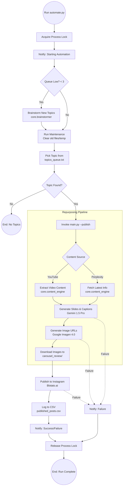

# AI Automated Social Media Generator Workflow

This document visualizes the complete automation workflow of the project, from topic brainstorming to Instagram publishing.

## Automation Flowchart

## Key Components

### 1. Automation Trigger (`automate.py`)
- **Queue Management**: Automatically refills the `topics_queue.txt` when it drops below 3 topics using Gemini-powered brainstorming.
- **Maintenance**: Deletes old review images and clears the `/temp` directory to save disk space.
- **Locking**: Prevents multiple instances from running concurrently.

### 2. Content Pipeline (`main.py`)
- **Sourcing**: Can ingest content from a YouTube URL or search the web via Perplexity for the latest AI/Tech news.
- **Content Engine**: Uses Gemini to transform complex information into engaging carousel slides, captions, and niche-specific hashtags.
- **Visual Engine**: Uses Google Imagen 4.0 to generate premium, brand-consistent visuals for each slide.

### 3. Distribution & Tracking
- **Blotato Integration**: Handles the API connection to Instagram for seamless publishing.
- **Multi-Channel Notifications**: Sends real-time status updates via Discord and Email.
- **Logging**: Maintains a `published_posts.csv` file for historical tracking and analytics.
